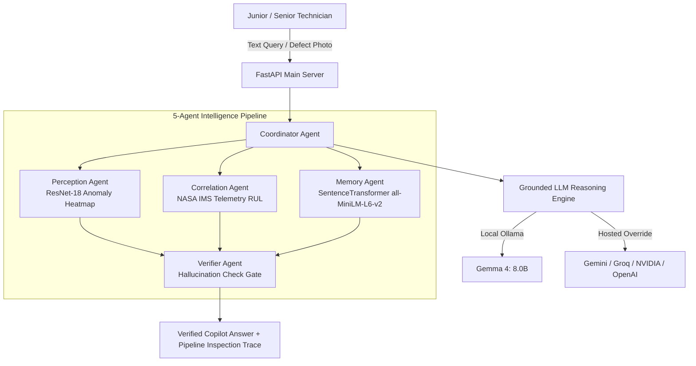

# TACET DISCORD 🧾
> **Shift-Handoff Copilot & Factory Incident Intelligence Framework**  
> *Preserving Senior Technician Tribal Knowledge with Active Evidence Gathering, Local Gemma 4 Reasoning, and Multi-Agent Hallucination Verification.*

---

## 🌟 Overview

**TACET DISCORD** is an AI-powered industrial incident intelligence framework designed for manufacturing environments. It bridges the gap between senior technician expertise and junior operational personnel by combining **visual anomaly detection**, **telemetry degradation modeling**, **vector-based semantic incident memory retrieval**, and **hallucination-verified LLM troubleshooting generation**.

---

## 🔥 Key Features & Capabilities

### 1. 📊 AI4I 2020 Real Industrial Dataset Seeding
- **Real Predictive Maintenance Data**: Loaded from 10,000 operational records sampled from the Kaggle/UCI AI4I 2020 dataset.
- **Categorized Failure Modes**: Supports Tool Wear Failure (`TWF`), Heat Dissipation Failure (`HDF`), Power Failure (`PWF`), Overstrain Failure (`OSF`), and Random Failures (`RNF`).
- **Telemetry-Rich Schemas**: Tracks air/process temperatures, rotational speeds (RPM), torque (Nm), and tool wear times.

### 2. 🧠 Semantic Text Matcher (`sentence-transformers`)
- **Model**: `all-MiniLM-L6-v2` generating 384-dimensional dense vector embeddings.
- **Paraphrased Query Retrieval**: Finds relevant historical incident records even when junior technicians use completely different wording or natural phrasing.
- **Dynamic Senior Record Embedding**: Automatically computes and indexes semantic vectors whenever a senior technician uploads new data via `/records/add`.

### 3. 🤖 Local Gemma 4 & Multi-API Reasoning Engine
- **Default Local Model**: Runs local **Gemma 4** (`gemma4:latest`) via Ollama (`http://localhost:11434`) out of the box with zero external API key requirements.
- **Hosted API Overrides**: Supports automatic fallback/override for hosted providers (`GEMINI_API_KEY`, `GROQ_API_KEY`, `NVIDIA_API_KEY`, `OPENAI_API_KEY`).
- **General Domain Knowledge Fallback**: When no strong database records match a query, the system generates best-effort technical troubleshooting steps using general engineering knowledge, explicitly wrapped with a **Tier 3 Warning Label** (`⚠️ General knowledge estimate — confirm with a senior technician`).

### 4. 🛡️ Hallucination Verification Gate
- **Claim Extraction & Grounding**: Verifies generated LLM diagnosis claims, numerical parameters, and fix action steps against retrieved evidence.
- **False Citation Detection**: Catches and flags invented database record IDs (`🛑 FAILED (Ungrounded Citation)`).
- **Reasoning Trace Preservation**: Records raw LLM outputs, evidence text, and verification claim scores in the `reasoning_trace` for full inspection in the UI.

### 5. 🤖 5-Agent Architecture
1. **Perception Agent**: Feature distribution fitting and visual anomaly heatmap generation (ResNet-18).
2. **Correlation Agent**: NASA IMS bearing telemetry signal processing & Remaining Useful Life (RUL) estimation.
3. **Memory Agent**: Hybrid vision embedding + semantic text vector retrieval.
4. **Verifier Agent**: Cross-agent evidence aggregation and Hallucination Gate validation.
5. **Coordinator Agent**: Multi-agent workflow orchestration and API response synthesis.

---

## 🏗️ System Architecture



---

## 🚀 Quickstart Guide

### 1. Prerequisites
- **Python**: `3.10+`
- **Ollama** (optional for local Gemma 4 execution): [Download Ollama](https://ollama.com/)

### 2. Installation
Clone the repository and install the required dependencies:

```bash
git clone https://github.com/developerHarish2007/Tacet-Discord.git
cd Tacet-Discord

python -m venv venv
# Windows:
venv\Scripts\activate
# Linux/macOS:
source venv/bin/activate

pip install -r requirements.txt
```

### 3. Start Local Gemma 4 Model (Optional)
If running Ollama locally:

```bash
ollama pull gemma4
ollama serve
```

### 4. Run the Application
Launch the FastAPI uvicorn application server:

```bash
python -m uvicorn main:app --host 127.0.0.1 --port 8000 --reload
```

Open your browser and navigate to: **[http://127.0.0.1:8000](http://127.0.0.1:8000)**

---

## 🌐 API Endpoint Reference

| Endpoint | Method | Description |
| :--- | :--- | :--- |
| `/health` | `GET` | Server health check and agent registration status. |
| `/factory-state` | `GET` | Returns active telemetry baseline, RUL, and memory bank counts. |
| `/junior/ask` | `POST` | Primary Junior Technician Q&A endpoint with semantic matching & LLM grounding. |
| `/records/add` | `POST` | Senior Technician manual record entry with auto-embedding. |
| `/perceive` | `POST` | Visual defect photo perception & heatmap generation. |
| `/correlate` | `POST` | NASA IMS telemetry feature extraction & RUL correlation. |
| `/ask` | `POST` | Classic 5-Agent Pipeline inspection run. |

---

## 🛠️ Project Structure

```text
Tacet-Discord/
├── coordinator/
│   ├── agent.py               # Main Coordinator Agent orchestration
│   └── llm_grounding.py       # Local Gemma 4 & Hosted API grounding engine
├── memory/
│   ├── agent.py               # Hybrid Memory Agent (Vision + Semantic Text)
│   ├── database.py            # SQLite database manager & AI4I 2020 seed loader
│   └── text_matcher.py        # SentenceTransformer all-MiniLM-L6-v2 matcher
├── perception/
│   └── agent.py               # Visual anomaly & heatmap perception agent
├── correlation/
│   └── agent.py               # Telemetry correlation & RUL estimation agent
├── verifier/
│   └── agent.py               # Hallucination Verification Gate agent
├── scripts/
│   └── download_ai4i_data.py  # Dataset loader & preprocessor script
├── static/
│   ├── index.html             # Web Application UI layout
│   ├── app.js                 # Frontend interactions & tab wire-ups
│   └── styles.css             # Industrial dark-mode CSS styling
├── data/                      # Dataset & upload store
├── main.py                    # FastAPI server entry point
├── README.md                  # Project documentation
└── requirements.txt           # Python dependencies
```

---

## 📄 License

Distributed under the MIT License. See `LICENSE` for details.
